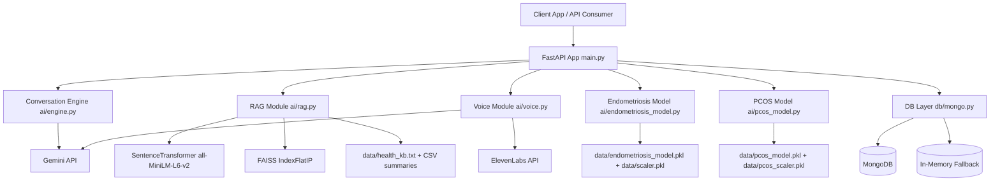

# Shakti AI Backend Architecture

## 1. Overview

Shakti is a modular FastAPI backend for conversational women's health support, risk-screening ML predictions, voice workflows, and retrieval-augmented answers.

Core design goals:
- fast API response for chat and screening endpoints
- graceful fallback if external services are down
- reusable model artifacts for production inference
- clear separation of API, AI logic, ML logic, and persistence

## 2. High-Level Architecture

## 3. Layered Breakdown

### 3.1 API Layer

Primary file: main.py

Responsibilities:
- expose REST endpoints
- validate requests with Pydantic models
- orchestrate calls to AI, ML, voice, and DB modules
- return consistent JSON responses

Key endpoints:
- chat and assistant flow: /chat, /voice-chat
- onboarding and journaling: /onboarding, /daily-checkin
- insight and learning: /pattern-insight, /learn, /alert, /summarize-session
- ML lifecycle: /train-endometriosis-model, /endometriosis-screening, /train-pcos-model, /pcos-screening
- operational checks: /health, /model-status

### 3.2 AI Orchestration Layer

Primary file: ai/engine.py

Responsibilities:
- prompt construction with safety and empathy system instructions
- chat completion with cycle context injection
- structured symptom extraction for hidden ML trigger routing
- educational content generation and session summarization
- provider error fallback responses
- telemetry integration for latency and success metrics

### 3.3 RAG Layer

Primary file: ai/rag.py

Responsibilities:
- load text KB and structured CSV-derived narratives
- generate semantic embeddings
- build FAISS vector index
- retrieve top-k relevant chunks for chat grounding
- fallback to lexical retrieval if semantic dependencies are unavailable

Data sources:
- data/health_kb.txt
- structured_endometriosis_data.csv
- FedCycleData071012 (2).csv

### 3.4 ML Layer

Primary files:
- ai/pcos_model.py
- ai/endometriosis_model.py

Shared approach:
- feature preparation and mapping
- stratified train/test split
- StandardScaler preprocessing
- RandomForestClassifier with class balancing
- model and scaler persistence using joblib

PCOS model:
- merges CSV and XLSX inputs when available
- maps categorical clinical attributes to numeric features
- outputs risk level and probability

Endometriosis model:
- supports structured and synthetic sources (CSV + PKL)
- maps symptom-heavy synthetic schema into six model features
- provides classification report, confusion matrix, and feature importance

### 3.5 Voice Layer

Primary file: ai/voice.py

Responsibilities:
- transcribe audio using Gemini multimodal endpoint
- synthesize speech via ElevenLabs when configured
- fallback to gTTS when ElevenLabs is unavailable
- return base64 audio for easy API transport

### 3.6 Persistence Layer

Primary file: db/mongo.py

Responsibilities:
- persist users, messages, and summaries in MongoDB
- fallback to in-memory collections if MongoDB is not configured/reachable
- keep API behavior stable even in local/offline mode

## 4. Core Request Flows

### 4.1 Chat with Optional RAG

1. Client calls /chat.
2. API loads user profile and recent history from persistence layer.
3. If use_rag=true, query_rag retrieves context chunks.
4. Engine builds prompt with cycle context and RAG context.
5. Gemini returns response.
6. Hidden symptom extraction may trigger PCOS/Endometriosis model inference.
7. Messages are stored and response is returned.

### 4.2 Endometriosis Training and Inference

Training flow:
1. Client calls /train-endometriosis-model.
2. Model resolves available datasets in priority order.
3. Data is normalized to model features.
4. Train/test split, scaling, Random Forest training, evaluation.
5. Model artifacts saved to data folder.

Inference flow:
1. Client calls /endometriosis-screening.
2. API maps request fields to feature vector.
3. Model/scaler are loaded from pkl if needed.
4. Prediction and probability are computed.
5. Personalized advice is generated and returned.

### 4.3 Voice Chat

1. Client uploads audio to /voice-chat.
2. Voice module transcribes audio.
3. Engine generates conversational response.
4. Voice module synthesizes response audio.
5. API returns transcript, text response, and base64 audio.

## 5. Data and Artifact Layout

Model artifacts:
- data/endometriosis_model.pkl
- data/scaler.pkl
- data/pcos_model.pkl
- data/pcos_scaler.pkl
- data/endometriosis_synthetic.pkl

Operational files:
- data/health_kb.txt
- telemetry.log

Datasets used by training and retrieval:
- structured_endometriosis_data.csv
- goldstein2023_endometriosis_synthetic.csv
- pcos_prediction_dataset.csv
- FedCycleData071012 (2).csv

## 6. Reliability and Fallback Strategy

External dependency fallback design:
- MongoDB unavailable -> in-memory storage fallback
- FAISS or sentence-transformers unavailable -> lexical retrieval fallback
- ElevenLabs unavailable -> gTTS fallback
- Gemini failure in specific operations -> deterministic text fallback messages

This keeps critical endpoints usable in constrained environments.

## 7. Security and Operational Notes

- Secrets are loaded from environment variables via .env.
- Sensitive keys should never be committed.
- CORS is currently permissive and should be restricted for production.
- Model endpoints are open and should be protected with auth/rate-limits in production.

## 8. Extension Points

Suggested future enhancements:
- add authentication and role-based access
- add model registry and versioned artifacts
- add background job queue for long-running training tasks
- add observability dashboard for telemetry and error rates
- move from in-memory fallback to durable local queue/cache for offline sync
